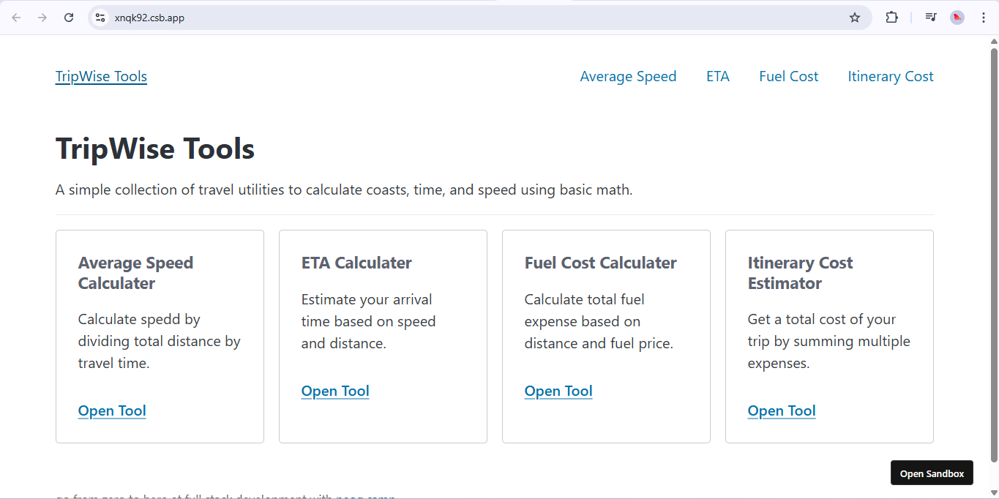
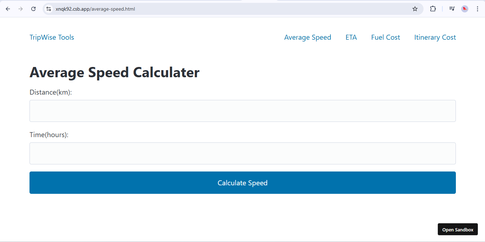
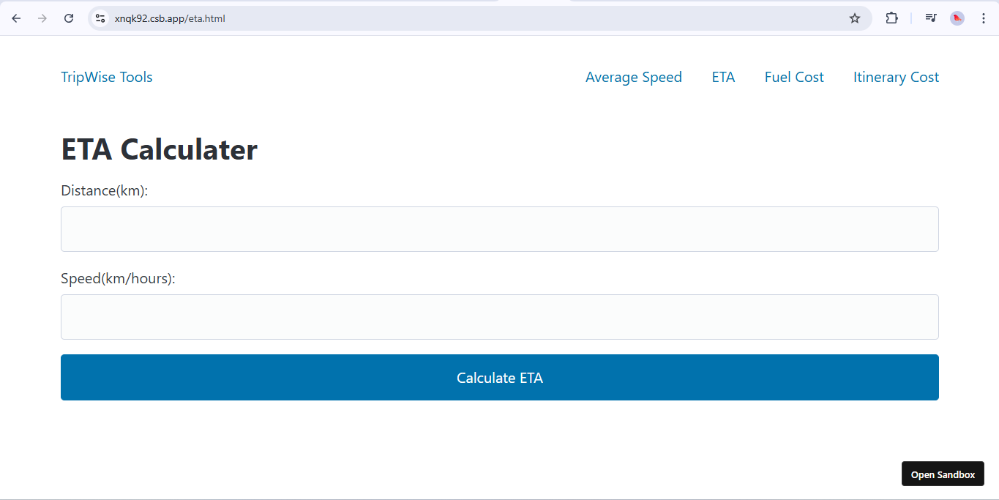
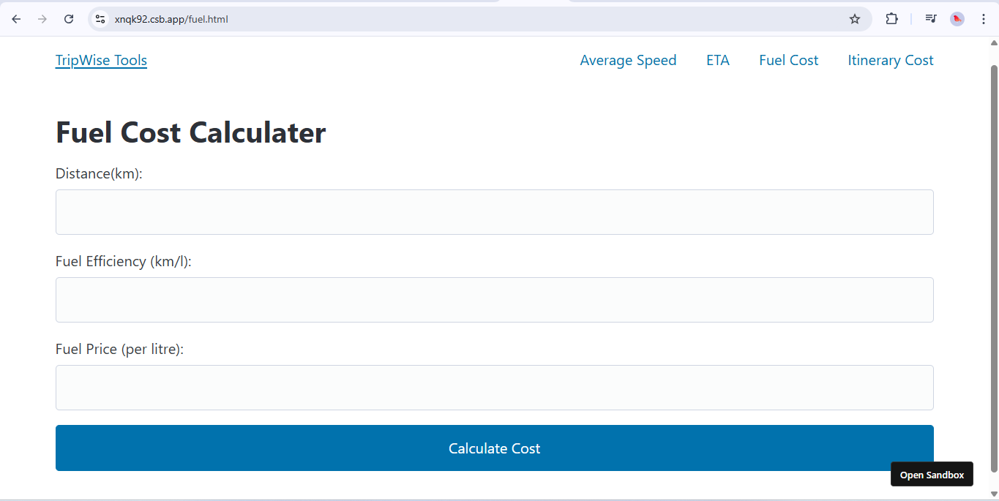
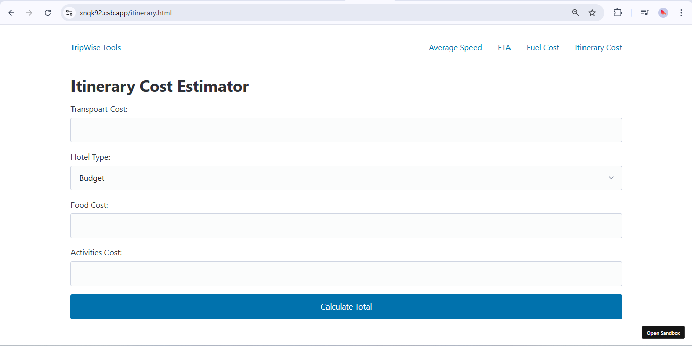

# TripWise 🚗🧮

**TripWise** is a simple, all-in-one travel calculator toolkit designed to make trip planning effortless. Calculate your average speed, ETA, fuel costs, and total itinerary expenses using clean, intuitive web tools.

[**Live Demo → tripwise-v1.netlify.app**](https://tripwise-v1.netlify.app/)

---

## ✨ Features

- **Average Speed Calculator:**  
  Compute speed by dividing total distance by travel time.

- **ETA (Estimated Time of Arrival) Calculator:**  
  Estimate your arrival time based on distance and speed.

- **Fuel Cost Calculator:**  
  Calculate total fuel expenses based on distance, efficiency, and fuel price.

- **Itinerary Cost Estimator:**  
  Sum up all your trip expenses—transport, hotel, food, and activities—for a quick total.

---

## 🖼️ Screenshots

### Home Page



### Average Speed Calculator



### ETA Calculator



### Fuel Cost Calculator



### Itinerary Cost Estimator



---

## 🚀 Quick Start

1. **Clone the repo:**
   ```bash
   git clone https://github.com/yourusername/tripwise.git
   ```
2. **Open `index.html` in your browser.**
3. Start calculating!

Or just use the [Live Demo](https://tripwise-v1.netlify.app/).

---

## 📦 Project Structure

```
tripwise/
│
├── index.html                # Home page with links to all calculators
├── average-speed.html        # Average Speed Calculator
├── eta.html                  # ETA Calculator
├── fuel.html                 # Fuel Cost Calculator
├── itinerary.html            # Itinerary Cost Estimator
├── assets/
│   └── css/main.css          # Custom styles
└── README.md                 # Project overview
```

---

## 🛠️ Tech Stack

- **HTML5 & CSS3**
- [Pico.css](https://picocss.com/) for minimal, responsive styling
- Vanilla JavaScript for interactive calculators

---

## 💡 Usage

- Open the [Live Demo](https://tripwise-v1.netlify.app/) in your browser.
- Click on any tool in the navigation bar to start calculating.
- Enter your trip details, and get instant results!

---

## 🎓 Attribution

Made with 💙 at [neog.camp](https://neog.camp)

---

## 📄 License

MIT © [TripWise Contributors](LICENSE.md)
